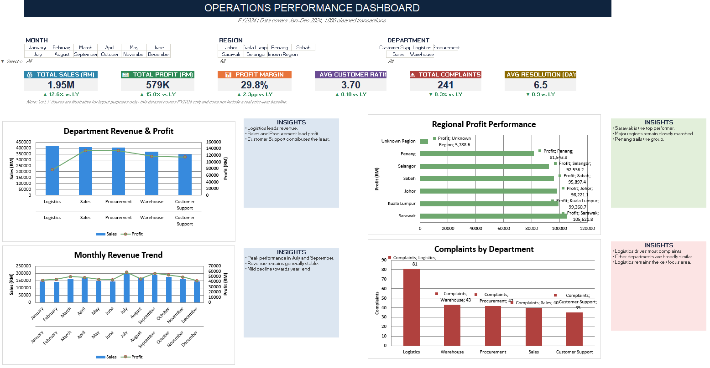

# Operations Performance Dashboard

An interactive Excel dashboard built to monitor sales, profit, and customer service performance across departments and regions for a multi-region operations business.

## Business Problem

Operations managers were reviewing performance reports manually every month with no single source of truth — sales numbers lived in one sheet, complaint logs in another, and nobody could quickly answer:

1. Are we hitting monthly targets?
2. Which department is actually performing well — and which one is dragging the numbers down?
3. Where are operational problems (complaints, slow resolutions) concentrated?
4. What should management act on first?

This dashboard answers all four from one screen, with live filters by Month, Region, and Department.

## Dataset

1,000+ transaction records across FY2024 covering:

| Column | Description |
|---|---|
| Transaction_ID | Unique ID per transaction |
| Date / Month | When the transaction occurred |
| Department | Sales, Logistics, Warehouse, Procurement, Customer Support |
| Region | Johor, Kuala Lumpur, Penang, Sabah, Sarawak, Selangor |
| Product_Category | Product line sold |
| Sales / Cost / Profit | Core financial metrics |
| Customer_Complaint | Yes/No flag |
| Resolution_Days | Days taken to resolve a complaint |
| Customer_Rating | 1–5 satisfaction score |
| Target_Status | Met / Missed monthly target |

The raw data was deliberately messy (inconsistent date formats, missing values, duplicate rows) to simulate a real company export, then cleaned using Power Query.

## Tools Used

- **Microsoft Excel** — Power Query, PivotTables, PivotCharts, slicers, KPI cards
- **Power Query** — data import, type correction, deduplication, missing-value handling
- **PivotTables** — department/region/month aggregations and complaint analysis

## Process

1. **Raw_Data** — unprocessed export with realistic data quality issues
2. **Operation_Data** — cleaned dataset after Power Query (correct types, no duplicates, derived Month Name / Quarter columns)
3. **Pivot Table Summary** — 9 pivot tables breaking down Sales & Profit by Department, Profit by Region, Monthly Trend, and Complaint Count by Department
4. **Dashboard** — final interactive layer: KPI cards, 4 charts, 3 slicers (Month, Region, Department), and insight call-outs per chart

## Key Findings

- **RM 1,946,103.74** in total sales generating **RM 578,969.57** profit, a **29.75%** profit margin
- **Logistics** leads on revenue (RM 418K), but **Sales and Procurement departments lead on profit**, both clearing RM 134K+
- **Customer Support contributes the least revenue** of the five departments — worth investigating whether this is a staffing or scope issue
- **241 total complaints** logged, with **Logistics responsible for 81 of them** — by far the highest of any department, despite not being the top revenue earner
- **Sarawak is the top-performing region by profit** (RM 105,621.77); **Penang trails the group** (RM 81,543.78)
- Average customer rating sits at **3.70 / 5**, with an average complaint resolution time of **6.5 days**
- Monthly revenue peaks in **July and September**, with a mild decline heading into Q4

## Dashboard Features

- 6 KPI cards: Total Sales, Total Profit, Profit Margin, Avg Customer Rating, Total Complaints, Avg Resolution Days
- Monthly Revenue & Profit trend chart
- Sales & Profit by Department chart
- Profit by Region chart
- Complaint Count by Department chart
- Interactive slicers for Month, Region, and Department
- Written insight call-outs next to each chart, translating the numbers into a takeaway

## Skills Demonstrated

`Excel` `Power Query` `Data Cleaning` `PivotTables` `PivotCharts` `KPI Design` `Dashboard Design` `Business Analysis`

## File

[`Operations_Performance_Dashboard.xlsx`](Operations_Performance_Dashboard.xlsx) — open in Excel, use the slicers at the top to filter by Month / Region / Department.
